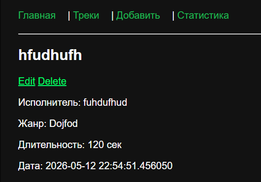
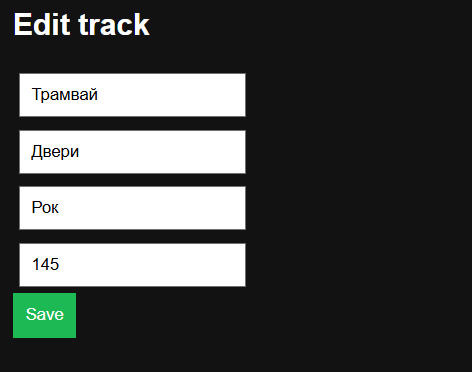
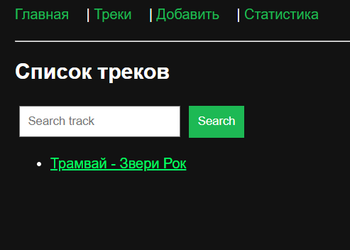
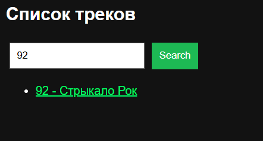
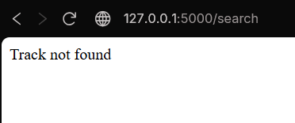
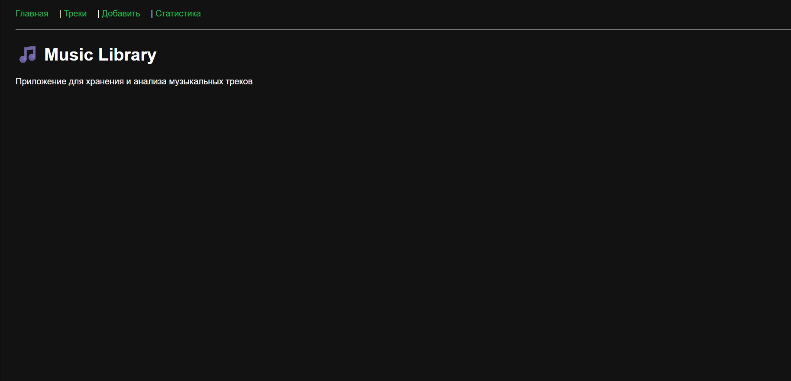
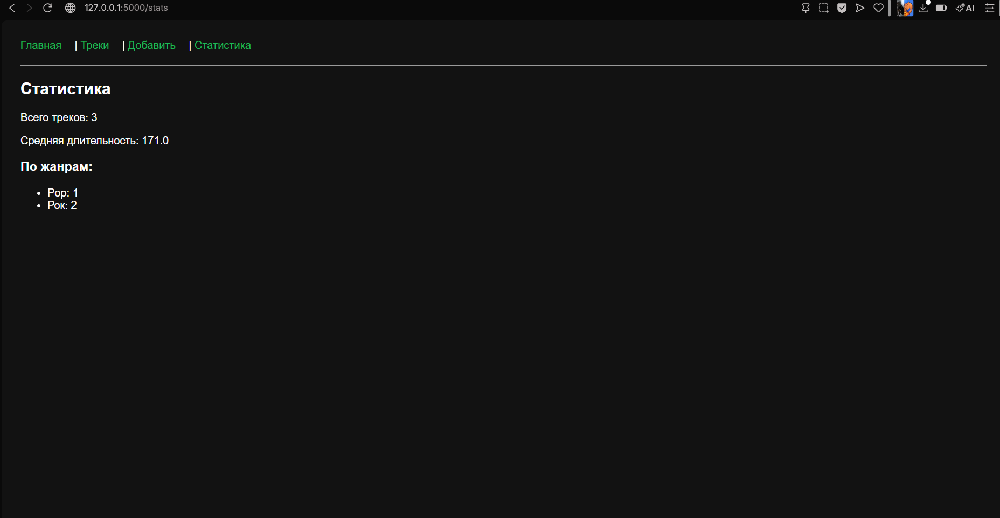

# ГОСУДАРСТВЕННЫЙ УНИВЕРСИТЕТ МОЛДОВЫ

## Факультет математики и информатики  
### Программа: Искусственный интеллект (IA2504)

---

## Лабораторная / Индивидуальная работа  
### Дисциплина: Python pentru aplicații

---

## Студент:  
Генчу Данила  

## Преподаватель:  
Виктория Требиш  

---

Кишинёв, 2026
---

## 1. Введение

В рамках индивидуальной работы было доработано веб-приложение, созданное на Flask.
Проект представляет собой музыкальный каталог, позволяющий управлять треками (добавление, просмотр, редактирование, удаление, поиск и аналитика).

---

## 2. Цель работы

Расширить функциональность лабораторной работы №7, улучшить работу с базой данных, добавить новые функции и повысить удобство использования веб-приложения.

---

## 3. Используемые технологии

* Python
* Flask
* SQLite
* HTML (Jinja2 шаблоны)
* CSS (минимальное оформление)

---

## 4. Структура проекта

```
project/
│
├── app.py
├── database.db
├── templates/
│   ├── base.html
│   ├── index.html
│   ├── tracks.html
│   ├── track.html
│   ├── add.html
│   ├── edit.html
│   ├── stats.html
│
├── static/
│   └── style.css
```

---

## 5. Реализованный функционал (из лабораторной работы)

* отображение списка треков
* просмотр одного трека
* добавление новых треков
* работа с SQLite базой данных
* статистика (общее количество, средняя длительность, группировка по жанрам)

---

## 6. Внесённые доработки (индивидуальная часть)

### 6.1 Удаление треков

Добавлена возможность удаления записи из базы данных.

**Функционал:**

* удаление по `id`
* обновление списка после удаления





---

### 6.2 Редактирование треков

Добавлена возможность изменения существующих записей.

**Функционал:**

* загрузка данных в форму (GET)
* сохранение изменений (POST)
* обновление записи в базе



---



---

### 6.3 Поиск треков

Реализован поиск по названию трека.

**Функционал:**

* ввод запроса
* поиск через SQL `LIKE`
* вывод результатов


---

## 7. Улучшение работы с базой данных

* использование SQLite
* защита от пустых значений
* проверка типов данных
* обработка ошибок (несуществующий ID)


---

## 8. Улучшение пользовательского интерфейса

* базовое оформление через CSS
* навигационное меню
* единый шаблон `base.html`
* использование наследования шаблонов Jinja2


---

## 9. Статистика

Реализована аналитика данных:

* общее количество треков
* средняя длительность
* количество треков по жанрам


---

## 10. Заключение

В результате выполнения индивидуальной работы было расширено Flask-приложение.
Добавлены функции редактирования, удаления и поиска данных, улучшена работа с базой данных и интерфейс пользователя.

Приложение стало полноценной CRUD-системой для управления музыкальными треками.


